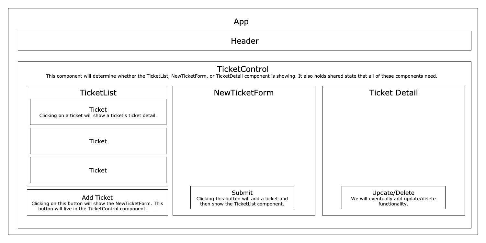

# 
 🎫 **Help Queue** 🎫 

_May 23, 2022_

#### _React website for handling help requests_

#### By _**John Whitten**_

## Table of Contents

1. [Description](#description)
2. [Technologies Used](#technologies)
3. [Setup/Installation Requirements](#setup)
4. [Known Bugs](#bugs)
5. [Contact Information](#contact)
6. [License](#license)

## Description 

This is a follow-along exercise for Epidocodus to practice making a React website with full CRUD functionality. The application should allow users to create, update, delete and read help requests.

## Website Components Planning

## Technologies Used 

* HTML
* CSS
* JavaScript/JSX
* NPM
* Webpack

## Project Setup/Installation Instructions 

* Navigate to the directory in which you would like to clone this project.
* Run `git clone https://github.com/johnwhittenstudio/help-queue.git` in terminal.
* Run `cd help-queue` to navigate into new project directory.
* Open the cloned repo in a text editor of your choice.
* Run `npm install` to download all dependencies.
* Run `npm run start` to start a live server and view projec in the browser.
* Run `npm run test` to run tests.

## Known Bugs 

- _None._

## Contact 

John Whitten - [Email](mailto:johnwhitten.studio@gmail.com) • [LinkedIn](https://www.linkedin.com/in/johnwhitten-studio/) • [GitHub](https://github.com/johnwhittenstudio)

## License 

Copyright (c) 2022 **_John Whitten_**

Permission is hereby granted, free of charge, to any person obtaining a copy of this software and associated documentation files (the "Software"), to deal in the Software without restriction, including without limitation the rights to use, copy, modify, merge, publish, distribute, sublicense, and/or sell copies of the Software, and to permit persons to whom the Software is furnished to do so, subject to the following conditions:

The above copyright notice and this permission notice shall be included in all copies or substantial portions of the Software.

THE SOFTWARE IS PROVIDED "AS IS", WITHOUT WARRANTY OF ANY KIND, EXPRESS OR IMPLIED, INCLUDING BUT NOT LIMITED TO THE WARRANTIES OF MERCHANTABILITY, FITNESS FOR A PARTICULAR PURPOSE AND NONINFRINGEMENT. IN NO EVENT SHALL THE AUTHORS OR COPYRIGHT HOLDERS BE LIABLE FOR ANY CLAIM, DAMAGES OR OTHER LIABILITY, WHETHER IN AN ACTION OF CONTRACT, TORT OR OTHERWISE, ARISING FROM, OUT OF OR IN CONNECTION WITH THE SOFTWARE OR THE USE OR OTHER DEALINGS IN THE SOFTWARE.

